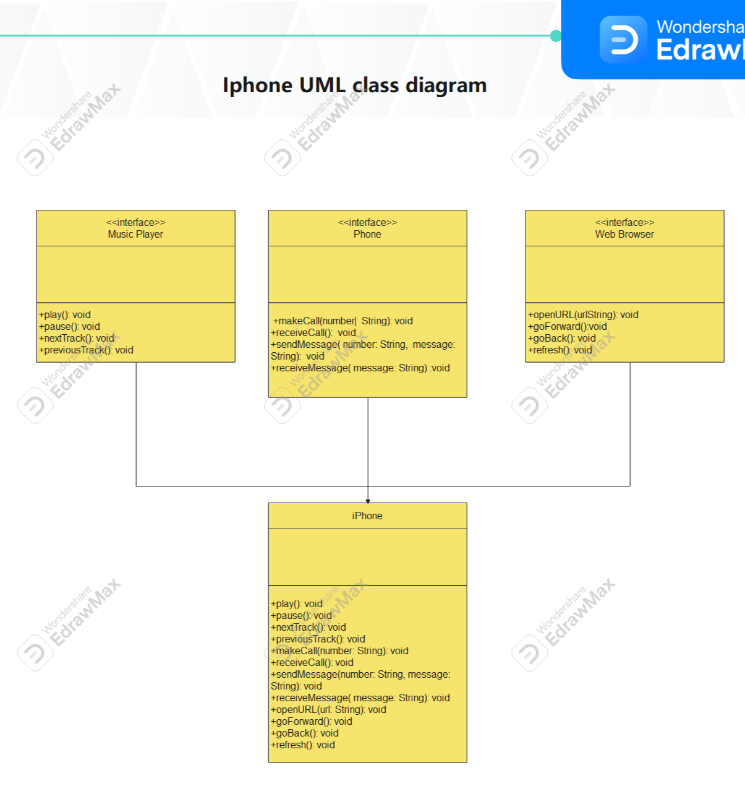

# Projeto iPhone UML & Java Implementation

Este projeto demonstra a concepção e implementação de um modelo orientado a objetos utilizando UML e Java para representar as funcionalidades de um iPhone como Reprodutor Musical, Aparelho Telefônico e Navegador na Internet.

## Visão Geral

O projeto consiste em um diagrama de classes UML que modela as principais funcionalidades do iPhone, seguido da implementação das classes e interfaces em Java.

### Funcionalidades Modeladas

1. **Reprodutor Musical (MusicPlayer)**
    - Tocar, pausar, avançar e retroceder músicas.

2. **Aparelho Telefônico (Phone)**
    - Fazer chamadas, receber chamadas, enviar e receber mensagens de texto.

3. **Navegador na Internet (WebBrowser)**
    - Abrir URLs, navegar para frente e para trás, recarregar páginas.

## Estrutura do Projeto

O projeto contém os seguintes arquivos Java:

- **`musicPlayer.java`**: Interface que define os métodos para o reprodutor musical.
- **`phone.java`**: Interface que define os métodos para o aparelho telefônico.
- **`webBrowser.java`**: Interface que define os métodos para o navegador na internet.
- **`iPhone.java`**: Classe que implementa as três interfaces, representando um iPhone com as funcionalidades descritas.

## Diagrama UML

### Estrutura do Diagrama UML

1. **Interfaces**:
    - `musicPlayer`: Define os métodos relacionados à reprodução de música.
    - `phone`: Define os métodos relacionados às funções telefônicas.
    - `webBrowser`: Define os métodos relacionados à navegação na web.

2. **Classe `iPhone`**:
    - Implementa as três interfaces mencionadas acima, combinando todas as funcionalidades em uma única classe.
